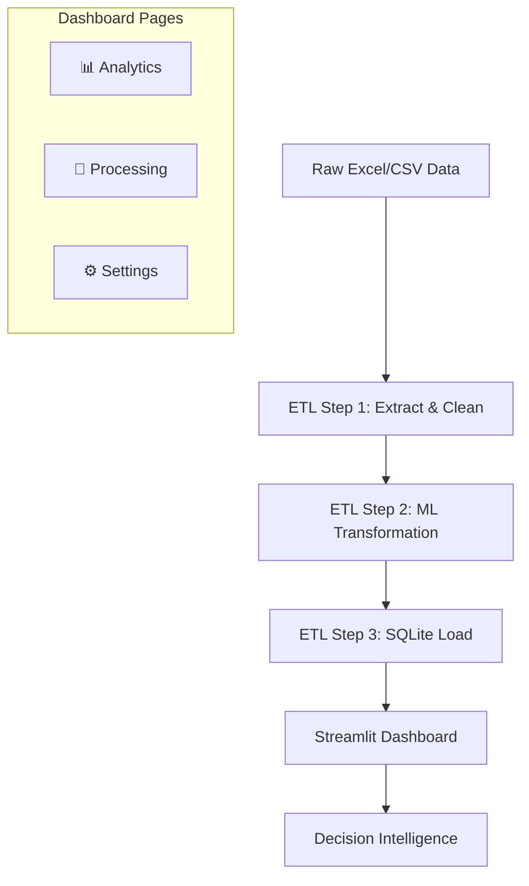

# 🏦 BTN Anchor Merchant — Decision Intelligence Dashboard


> **Modernizing Bank BTN's Merchant Portfolio Management via ETL, Machine Learning, and Interactive Dashboards.**

This project provides a comprehensive end-to-end pipeline to monitor, analyze, and predict merchant performance. It handles massive Excel-based monitoring sheets, classifies merchants using K-Means++ clustering, and identifies churn risks via multi-layer anomaly detection.

---

## ✨ Key Features

### 🚀 High-Performance ETL
- **Regex-Driven Classification**: Automatically extracts and cleans Anchor vs. Retail merchant groups from raw MID lists.
- **Legacy Excel Integration**: Uses `win32com.client` (COM interface) to interact with corporate Master files without destroying built-in formulas, pivots, or formatting.
- **Automated Parameter Overrides**: Natively bumps the Excel "Week Ceiling" to support 53-week monitoring without `#VALUE!` errors.

### 🧠 Machine Learning Engine
- **K-Means++ Clustering**: Segments merchants into **PREMIUM**, **REGULER**, and **PASIF** tiers based on Sales Volume, Transaction Count, and Fee-Based Income.
- **Churn & Anomaly Detection**: Integrated Z-Score and Interquartile Range (IQR) logic to flag high-risk merchants exhibiting sudden volume drops or persistent inactivity.
- **Dynamic Re-computation**: The dashboard runs the ML logic in real-time, allowing for live "what-if" analysis of the portfolio.

### 📊 Professional Analytics UI
- **Dual-Mode Theming**: Seamlessly switch between a **Dark Navy & Gold** premium aesthetic and a high-contrast **Warm Cream** light mode.
- **Heatmaps & Trends**: Interactive Plotly-based weekly activity heatmaps and trend charts with WoW/MoM growth overlays.
- **Data Export**: One-click CSV exports for any filtered view (PM Summary, Merchant Matrix, etc.).

---

## 🛠️ Tech Stack
| Category | Technology |
|---|---|
| **Language** | Python 3.10+ |
| **Data Processing** | Pandas, NumPy, OS, Regex |
| **Machine Learning** | Scikit-Learn (Clustering), SciPy (Statistics) |
| **UI/UX** | Streamlit, Plotly, Vanila CSS |
| **Database** | SQLite |
| **Automation** | Python `win32com.client` (Excel Shell) |

---

## 🏗️ Project Architecture



---

## 🚀 Getting Started

### 1. Prerequisites
- Windows OS (Required for `win32com.client` Excel automation)
- Microsoft Excel installed

### 2. Installation
```bash
# Clone the repository
git clone https://github.com/your-repo/btn-anchor-dashboard.git
cd btn-anchor-dashboard/Project

# Install dependencies
pip install -r requirements.txt
```

### 3. Usage
```bash
# Initialize the database
python setup_database.py

# Run the dashboard
streamlit run app.py
```

---

## 📸 Dashboard Preview

````carousel

<!-- slide -->

````

---

## 🐛 Recent Upgrades
- **Unit Formatting**: Implemented `_fmt_juta()` to avoid "Rp 0.00M" errors by correctly scaling Juta/Milyar units.
- **Parsing Robustness**: Added `ffill()` logic to handle block-header names in heavy Excel monitoring sheets.
- **Navigation UX**: Restructured sidebar to prioritize Analytics and integrated a native theme toggle switch.

---
*Created as part of the UMN Semester 6 Internship Program (Magang Materi Sidang).*
